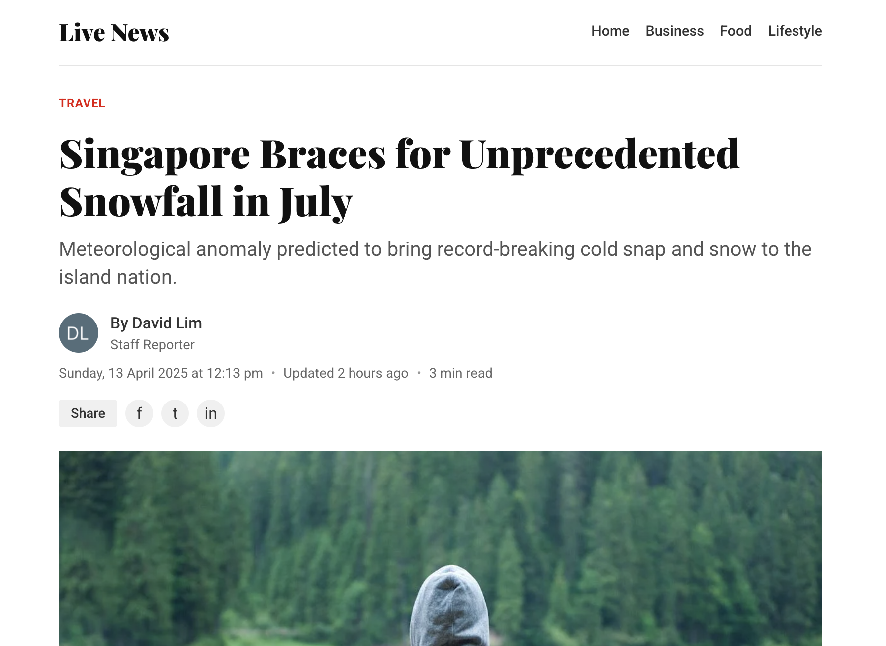
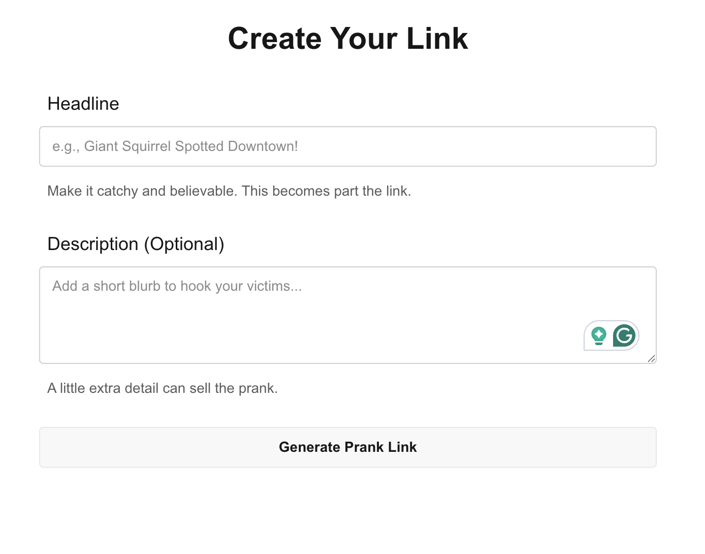
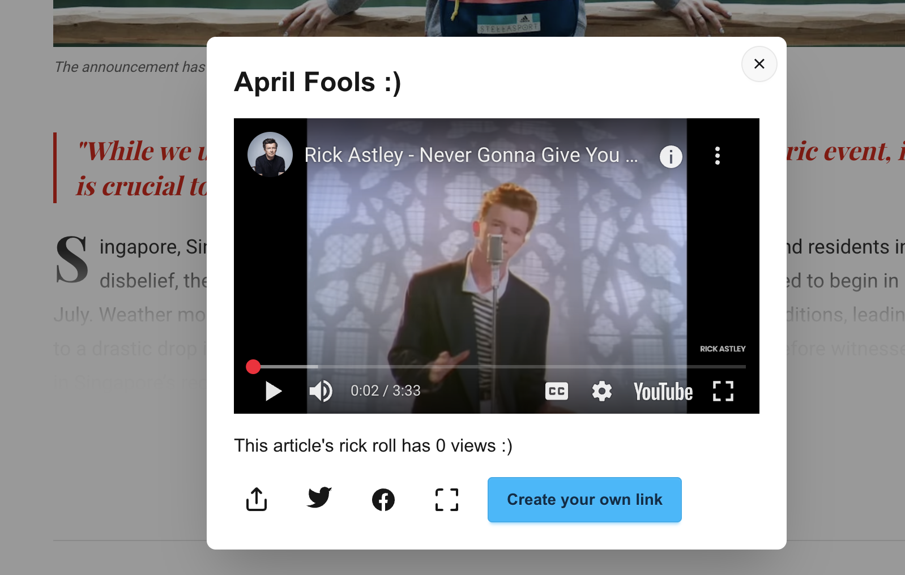

# Prank Article Generator

A fun web application that lets you create convincing fake news articles which turns out to be a rick roll for April Fools' Day or anytime you want to prank your friends!

## Features

- Create customized fake news articles, breaking news alerts, and social media posts
- Easy-to-use interface for crafting the perfect prank
- Shareable links to send to your friends
- Built-in Rick Roll functionality (because no prank is complete without it)

## Screenshots

### Creation Page

### Article with Classic Rick Roll

## How It Works

1. Choose your prank type (news article, breaking news, social post)
2. Enter your headline and description
3. Generate a shareable link
4. Send to your friends and enjoy their reaction!

## Tech Stack

- Next.js 14
- TypeScript
- TailwindCSS
- DaisyUI

## Disclaimer

This project is meant for harmless fun. Please use responsibly and don't create content that could cause harm, panic, or spread actual misinformation.

## License

MIT
