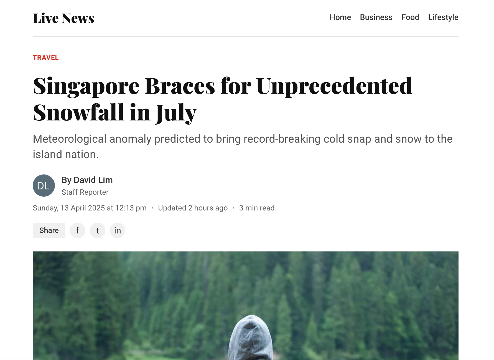

# LLM Prank Article Generator

A Next.js web application that leverages Generative AI to create realistic-looking fake news articles for april fools.

**[www.direct-news.live/create-for-real](https://www.direct-news.live/create-for-real)**

> **Note:** The generation takes about 10 seconds.

## Overview

This application allows users to generate custom "news articles" by simply providing a topic. It uses **Google's Gemini** model to craft convincing headlines and article body text, mimicking the style of real journalism. The generated pages are designed to look authentic before revealing the prank (a classic Rickroll) to the reader.

## Tech Stack

- **Framework:** Next.js 14 (App Router)
- **Language:** TypeScript
- **AI Integration:** Google Generative AI SDK (Gemini)
- **Styling:** Tailwind CSS, DaisyUI
- **Database:** Firebase (Firestore)

## Disclaimer

This project is intended for educational purposes and harmless fun. It serves as a demonstration of how AI can be used to generate synthetic media. Please use responsibly.

## License

MIT
